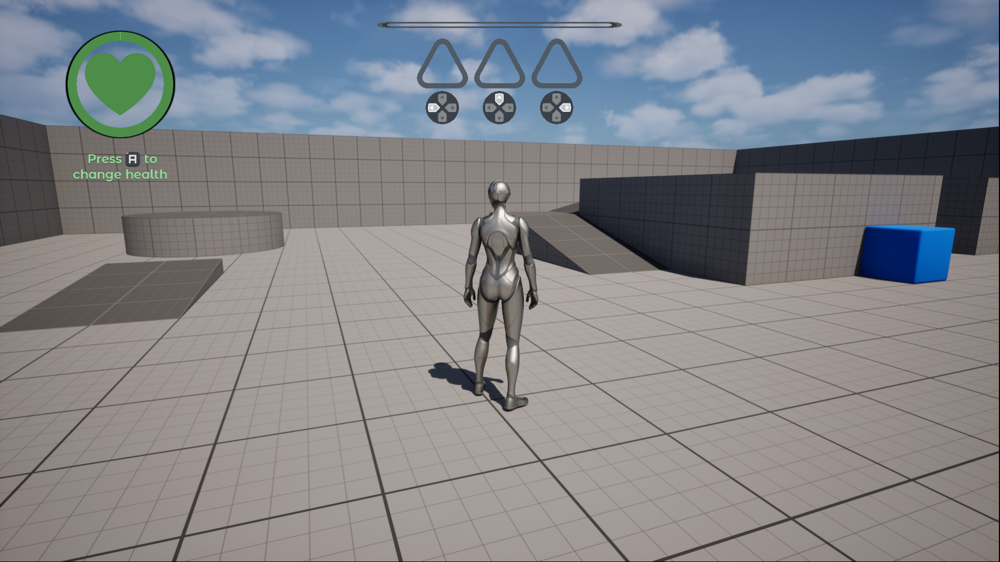
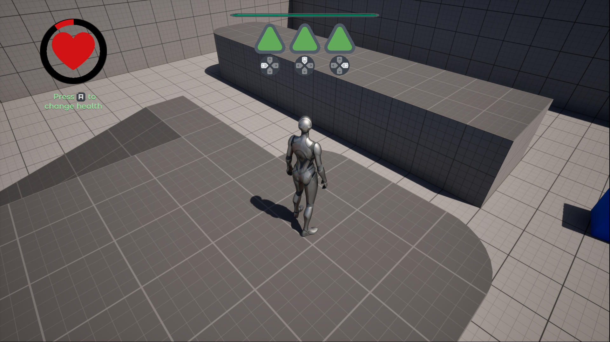
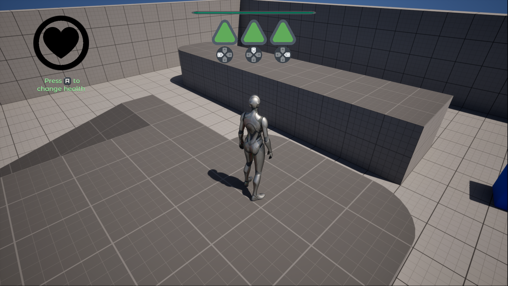

## Overview
This test task demonstrates UMG skills. The player can use either keyboard or gamepad. It features:
* Health widget
* Gamepad interaction HUD
* Pause menu

## Health Widget
Health widget is interactive. To reduce health, use A on your gamepad or H on your keyboard. Once your health reaches 20%, it becomes red and the heart plays animation to signal that the health level is low

https://github.com/user-attachments/assets/6159f85b-c3e8-4c26-95c0-c46d72f971f2

## Gamepad interaction HUD
You can interact with gamedap section either by using D-pad keys on your gamepad or arrows on your keyboard. When you interact with 1 of 3 elements, it increase the progress of all activated slots. You can either activate a slot or deactivate it by pressing the same button. Once all 3 slots are activated, they signal the fulfilled progress with a pulsing animation.

https://github.com/user-attachments/assets/13326b29-564f-4ab2-a84b-044f67438dc8

## Pause menu
Pause menu can be activated by pressing Escape or M button. Once the player brings up it, the game pauses and the background goes blurry. The menu has 2 options: Resume and Exit. Both of these widgets play animation whenever player hovers mouse over them. When the player presses Resume, the game unpauses and blurry effect disappears. Exit button closes the game.

https://github.com/user-attachments/assets/755fc7ec-ea68-4cd1-b0a5-d67f35085aef

Software used: 
Unreal Engine 5.5.4
